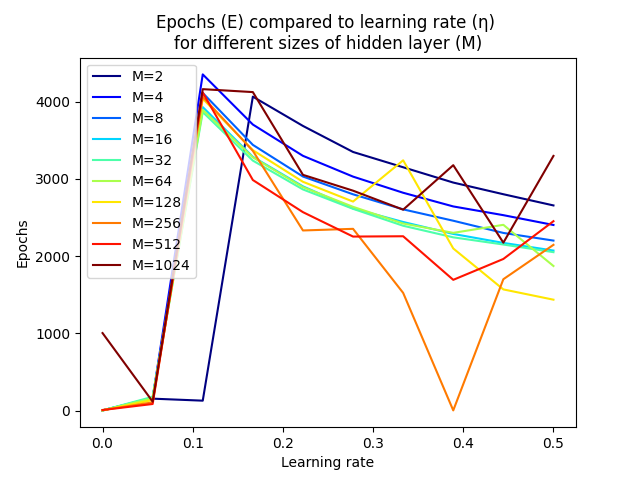

# Description

The project was created as an assignment for the lesson *"Machine Learning"*.\
The goal was to implement **2 Binary Classifiers**, in Python, and train/test them on a subset of the **MNIST** dataset.

# What was implemented:

## Part A (Pre-processing)

* Download the data of classes "5" and "6", which are already separated in train and test set. Then split the given train set in a ratio of 80%/20%. Use the smallest subset as the validation set.

* Preprocess all images (train, validation and test) in the following way: 
    * Convert any 28 × 28 pixel image into a 784 element vector.
    * Convert all elements of said vectors, from integers in the interval [0, 255] to real numbers in the interval [0, 1].

## Part B (Logistic Regression)

* **Implement a logistic regression model for binary classification** of classes "5" and "6", which will be trained using gradient ascent. The optimizer must be written from scratch.

* **Train the classifier on the training set** for a finite number of iterations. Calculate the percentage of correctly classified control patterns on the testing set and **record** this **accuracy**.

* **Add L2 regularization** on the training. 
    * **Train 100 normalized versions of the classifier, each with a different value of the scalar coefficient λ** (normalization hyperparameter L2). The different values ​​of λ must cover a range from 1e-4 to 10. 
    * **Evaluate the classification accuracy** of each resulting model (out of said 100) **on the validation set** separately and select the one with the smallest validation error. 
    * Then evaluate its **accuracy on the test set**.

## Part C (Neural Network)

* **Construct an MLP for binary classification**:
    * *784* neurons in input layer
    * *M* neurons in hidden layer
    * *1* neuron in output layer
    * Use **logistic sigmoid** as the activation function
    * Manually implement **gradient descent** and **error back-propagation**

* Train the model and implement **early stopping**:
    * **after each epoch calculate the average cost** of each season current model in the validation set and
    * **terminate training if** it the average validation **cost** shows **no decrease (or increase) for *5* consecutive epochs**
    * in the end, save as optimal the model of the epoch with the minimum mean validation cost

* Repeat the above procedure for different hyperparameter values ​​(learning rate *η*, *M* neurons in hidden layer)
    * 10 different values ​​of *η* in a range from 1e−5 to 0.5. Think about how to spread optimally the 10 values ​​of n within this range
    * 10 different values ​​of *M*, starting from 2 and doubling each time
    * keep as optimal only the model with overall minimum average validation cost and record its hyperparameter values (learning rate, size of hidden layer, epochs)

* Use the stored overall best trained model to **calculate the percentage of correctly classified values of the test set**, comparing for each the prediction of the model with the corresponding label (classification accuracy). Record this to be exact.

# Results

## Part B (Logistic Regression)

* The classifier was trained for a different number of loops: 

    | Iterations | Accuracy (on test set) |
    |:----------:|:----------------------:|
    | 10         | 88.0000 %              |
    | 100        | 94.9730 %              |
    | 1000       | 97.2432 %              |
    | 10000      | 98.0541 %              |

    We see that the accuracy improves as the iterations increase, as the weights are better adjusted.
    (Note: The accuracy changes slightly every time we run the program, because the data is loaded from the beginning, and the training set is randomly divided into training and validation sets.)

* We trained 100 normalized versions of the classifier, each with a different value of the coefficient λ (λ∈[1e-4, 10]), using the linspace function of numpy. \
For each model we used 100 iterations, since it was observed previously that the model gives sufficiently accurate results (almost 95% accuracy), and is executed in a (relatively) short time. \
\
Evaluating the model on the validation set, we concluded that the "best" (i.e. with the smallest validation error) value of the coefficient λ was 0.0001, with an accuracy of 95.24%. \
For this value of the coefficient λ, evaluating the model on the control set (test set), we had an accuracy of 94.97%.

## Part C (Neural Network)

* (See class *MLP* in `MLP.py`)

* The best calculated model stopped at *4229* epochs, with cost: *0.0614*

* We repeated the above procedure 100 times, for 10 different learning rates, and 10 different populations of neurons in the hidden layer.\
    For the learning rate values ​​we used the linspace function of np, in order for our values ​​to be as spread out as possible in [1e-5, 0.5].
    We notice that the optimal model calculated (in terms of validation cost) had:
    * learning rate (*η*) = 0.33333666666666667
    * 128 neurons in the hidden layer (*M*)
    * 3241 seasons (*E*)
    * cost = 0.05211579017774644

    We saved the parameters (*E*, *η*, *M*) of all models in order to examine the relationship between *Ε* (seasons), and *η* (learning rate).

    

    From the above diagram we can see that, with the exception of the first values ​​(with a small *M*) that terminate prematurely, as the learning rate (*η*) increases, the epochs (*E*) for which the model runs decrease. This is probably due to the fact that the model learns more easily, and therefore takes fewer epochs to achieve the corresponding cost.

* The accuracy of the best model (calculated previously) on the test set is *98.05405405%*.
